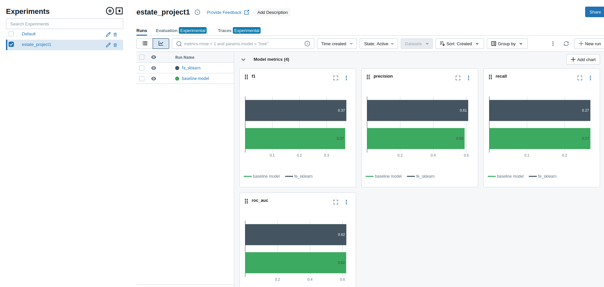

# Описание проекта
В проекте определяется банковский кредитный скоринг клиента.

[Исходная выборка ](https://www.kaggle.com/datasets/kapturovalexander/bank-credit-scoring/data)

# Запуск проекта
Для запуска необходимо выполнить команды:
```
git clone https://github.com/KochurovaVA/IIS.git
cd /IIS/
python -m venv venv
venv\Scripts\activate.bat
pip install -r requirements.txt
```
# Исследование

Находится в `C:/home/mainuser/my_proj/eda/eda.ipynb`. 

В ходе исследования были проведены действия:
* Удалены признаки "pdays","previous", "poutcome", так как не удалось обнаружить их теоретический и физический смысл
* В ходе анализа не было обнаружено аномальных значений признаков, противоречащих их физическому смыслу. Ни одна запись не была удалена.
* Столбцам 'job', 'marital', 'education', 'default', 'housing', 'loan', 'contact', 'month', 'y' был присвоен категориальный тип
* Численныи столбцам ('age', 'balance', 'day', 'duration', 'campaign') был присвоен соответсвующий тип данных, подходящий под конкретный "разброс" значений

Были выявлено: 
* В среднем у управленцев баланс больше, чем у студентов и беразботных (`./eda/Соотношение баланса и трудоустройства.png`)
* Женатым клиентам чаще отказывают в выдаче кредита, чем разведённым или холостым (`./eda/Зависимость отказов и семейного положения.png`)
* Зависимость баланса от возраста - в среднем пик приходится на 35 и 55 лет (`./eda/Зависимость баланса и возраста.png`)
* На иппотеку отказывают чаще, чем на кредиты для других потребностей (`./eda/Зависимость ипотеки и отказов.png`)
* Слабая корелляция признаков (`./eda/Корреляционная матрица.png`)

Обработанная выборка сохранена в файл `./data/clean_data.pkl`

# Результаты исследования

По результатам исследований были получены следующие метрики качества:


Наилучшие результаты в ходе эксперимента показала последняя модель, в ходе которых были применены следующие настройки:
* добавление новых признаков

```
'num__age', 'num__balance', 'num__day', 'num__duration', 'cat__job',
'cat__marital', 'cat__education', 'cat__default', 'cat__housing','cat__loan','cat__contact', 'cat__month', 'cat__campaign','quantile__balance', 'poly__1', 'poly__age', 'poly__balance','poly__age^2', 'poly__age balance', 'poly__balance^2', 'kbins__age','kbins__balance', 'kbins__day', 'kbins__duration'
```

* отобраны наиболее "важные признаки"

```
'num__age', 'num__day', 'num__duration', 'cat__default', 'cat__housing', 'cat__loan', 'cat__contact', 'cat__month', 'cat__campaign'
```